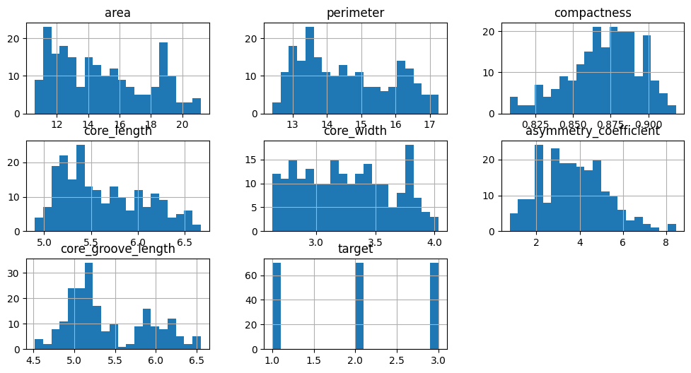

# Da Terra ao Código: Automatizando a Classificação de Grãos com Machine Learning - Fase 4 - Capítulo 3 - FIAP

## Nome do Grupo

#### Nomes dos integrantes do grupo

- Brenner H F Araújo 
- Bryan Fagundes 
- Diogo Botton 
- Hyanka Coelho 
- Juliana Hungaro Fidelis 

## Sumário

[1. Introdução](#c1)

[2. Visão Geral do Projeto](#c2)

[3. Desenvolvimento do Projeto](#c3)

[4. Resultados e Avaliações](#c4)

[5. Conclusões e Trabalhos Futuros](#c5)

[6. Referências](#c6)

[Anexos](#c7)

 

# 1. Introdução

## 1.1. Escopo do Projeto

### 1.1.1. Contexto da Inteligência Artificial

A FarmTech Solutions atua no crescente segmento da agricultura de precisão, utilizando a inteligência artificial para otimizar processos agrícolas e aumentar a produtividade. Nossa solução se concentra em desenvolver ferramentas e plataformas que utilizam dados de sensores, imagens de satélite e outras fontes para fornecer insights valiosos aos agricultores. Através da análise desses dados, nossos sistemas podem identificar padrões, prever resultados e recomendar ações personalizadas, como a aplicação precisa de fertilizantes e a otimização da irrigação. Essa abordagem permite que os agricultores maximizem a eficiência de seus recursos, reduzam custos e contribuam para a sustentabilidade do agronegócio. Nosso foco inicial é o mercado brasileiro, onde a agricultura desempenha um papel fundamental na economia, mas vislumbramos expandir nossas operações para outros países da América Latina e, futuramente, para o mercado global.

### 1.1.2. Descrição da Solução Desenvolvida

Desenvolvemos um sistema de classificação automática de grãos de trigo, empregando técnicas avançadas de aprendizado de máquina. Utilizamos a metodologia CRISP-DM (Cross-Industry Standard Process for Data Mining), garantindo um processo estruturado e eficaz de mineração de dados.

Nossa solução é um modelo de machine learning robusto, capaz de identificar e classificar com precisão diferentes variedades de trigo com base em suas características físicas. Esta abordagem representa uma significativa evolução em relação aos métodos manuais tradicionais, oferecendo diversos benefícios, como 

- Eficiência: A automação reduz drasticamente o tempo de classificação, otimizando o fluxo de trabalho nas cooperativas.
Confiabilidade: O uso de algoritmos de aprendizado de máquina minimiza erros humanos, elevando a precisão das classificações.
- Objetividade: A análise baseada em dados das propriedades físicas dos grãos assegura uma classificação imparcial e consistente.
- Adaptabilidade: Embora inicialmente focada em cooperativas menores, a solução é flexível e pode ser expandida para atender operações de maior escala.
- Impacto operacional: A implementação deste sistema promove uma melhoria substancial na eficiência geral das operações de classificação de grãos.

# 2. Visão Geral do Projeto

## 2.1. Objetivos do Projeto

Desenvolver um modelo de aprendizado de máquina que classifique variedades de grãos de trigo com base em suas características físicas.

## 2.2. Público-Alvo

Cooperativas agrícolas de pequeno porte que buscam uma solução classificação automática de grãos.

## 2.3. Metodologia

Primeiramente realizamos uma análise exploratória para entender os dados, verificando o balanceamento dos dados, verificando dados nulos ou vazios, a distribuição dos dados, matriz de correlação e gráficos de dispersão.

Em seguida, começamos a dividir os dados em treino e teste e fazer o treinamento com a metodologia mais simples, a Hold Out, que se trata da separação dos dados em treino e teste apenas uma única vez.

Após os testes do modelo, verificamos a necessidade de realizar validação cruzada para ter uma visão mais geral sobre o modelo e em seguida, adicionamos busca de hiperparâmetros com validação cruzada com GridSearchCV e RandomizedSearchCV.

# 3. Desenvolvimento do Projeto

## 3.1. Tecnologias Utilizadas

Para o desenvolvimento deste projeto, utilizamos as bibliotecas pandas, matplotlib, seaborn e scikit-learn.

## 3.2. Modelagem e Algoritmos

Utilizamos 4 tipos de algorítmos diferentes para comparação:
- Árvore de Decisão
- Floresta Aleatória
- SVC
- KNN

**Árvore de Decisão (Decision Tree)**
A Árvore de Decisão foi selecionada devido à sua capacidade de criar regras hierárquicas e interpretáveis. Esse algoritmo constrói divisões sucessivas nos dados com base em condições que maximizam a separação entre as classes, o que é útil para problemas onde a decisão pode ser representada por uma sequência lógica de condições.

**Floresta Aleatória (Random Forest)**
A Floresta Aleatória foi incluída como uma extensão das Árvores de Decisão, agregando previsões de múltiplas árvores treinadas em diferentes amostras do conjunto de dados. Essa abordagem reduz o risco de overfitting, melhora a generalização e oferece um modelo robusto para problemas com variáveis interdependentes, como as características físicas e químicas dos grãos.

**SVC (Support Vector Classifier)**
O SVC foi escolhido para explorar a hipótese de que os dados podem ser separáveis por um hiperplano ótimo em um espaço dimensional mais alto. Esse modelo é particularmente eficaz em casos onde as classes têm fronteiras não lineares e os dados possuem ruído ou complexidade nas interseções entre classes.

**K-Nearest Neighbors (KNN)**
O KNN foi incluído como uma abordagem baseada em instâncias, avaliando a proximidade dos dados no espaço das características. Ele foi selecionado para explorar a hipótese de que a classificação de cada grão pode ser inferida diretamente de seus vizinhos mais próximos, sem a necessidade de modelagem de um hiperplano ou construção hierárquica.

## 3.3. Treinamento e Teste

Inicialmente, adotamos a abordagem mais simples para treinamento e avaliação, utilizando a metodologia Hold-Out. Essa técnica consiste em dividir o conjunto de dados em duas partes: uma para treinamento e outra para teste, mantendo essa separação fixa ao longo do processo. Essa abordagem inicial nos permitiu avaliar rapidamente o desempenho dos modelos treinados em dados não vistos.

Com base nos primeiros resultados, identificamos a necessidade de uma avaliação mais robusta e representativa. Para isso, implementamos a Validação Cruzada (Cross-Validation), uma metodologia que divide os dados em múltiplos subconjuntos (ou folds) e realiza várias iterações de treinamento e teste, garantindo que todos os dados sejam utilizados em ambas as fases. Essa técnica nos forneceu uma visão mais geral sobre a performance dos modelos, reduzindo o viés associado à separação inicial dos dados.

No entanto, percebemos que a validação cruzada sozinha não era suficiente para garantir a escolha do melhor modelo, uma vez que os hiperparâmetros dos algoritmos tinham um impacto significativo no desempenho final. Para resolver isso, incorporamos estratégias de otimização de hiperparâmetros:

**GridSearchCV:** 
Realizou uma busca exaustiva por todas as combinações possíveis de valores de hiperparâmetros, garantindo que não houvesse lacunas nas opções avaliadas.

**RandomizedSearchCV:** 
Complementou a busca, explorando combinações aleatórias de hiperparâmetros em um espaço definido, reduzindo o custo computacional em cenários com muitas combinações possíveis.
Essas abordagens combinadas nos permitiram identificar tanto os melhores hiperparâmetros quanto o modelo mais adequado ao problema, garantindo uma escolha otimizada e fundamentada para o nosso caso de uso.

# 4. Resultados e Avaliações

## 4.1. Análise dos Resultados

Após aplicar os modelos (Árvore de Decisão, Floresta Aleatória, SVC e KNN) e realizar a busca de hiperparâmetros, os resultados mostraram que o KNN apresentou o melhor desempenho, alcançando um test_score de 96%. Em seguida, o SVC obteve 95%, enquanto a Floresta Aleatória e a Árvore de Decisão tiveram desempenhos semelhantes, com 93,33% cada.

**Variáveis Mais Importantes**
Uma análise das variáveis mais relevantes para os modelos revelou algumas diferenças e semelhanças:

- Para a maioria dos modelos, o comprimento do sulco do núcleo destacou-se como a variável mais importante na classificação dos grãos, indicando sua forte correlação com os resultados.
- Nos modelos baseados em árvores (Floresta Aleatória e Árvore de Decisão), as duas variáveis mais relevantes foram o comprimento do sulco do núcleo e a área, sugerindo que essas características estruturais desempenham papéis complementares no processo de decisão hierárquica.
- Por outro lado, nos modelos SVC e KNN, as duas variáveis mais importantes foram o comprimento do sulco do núcleo e o coeficiente de assimetria, mostrando que, para métodos baseados em separação geométrica e proximidade, o formato e a distribuição dos grãos têm maior influência na classificação.

**Comparação e Discussão**

Os resultados indicaram que, embora todos os modelos tenham alcançado altas taxas de acurácia, os métodos baseados em proximidade (KNN) e separação (SVC) tiveram uma leve vantagem. Essa diferença pode ser atribuída à distribuição dos dados e à relevância das variáveis selecionadas:

- O KNN, por exemplo, pode ter se beneficiado de uma boa separação entre classes no espaço das características, tornando sua abordagem direta e baseada em vizinhança mais eficiente.
- O desempenho ligeiramente inferior da Floresta Aleatória e da Árvore de Decisão pode ser explicado pelo fato de que esses métodos têm maior propensão a depender de divisões hierárquicas que podem não capturar plenamente a interação entre as variáveis mais importantes.

As diferenças observadas entre os modelos reforçam a importância de considerar as características específicas dos dados e do problema ao selecionar algoritmos de aprendizado de máquina.

## 4.2. Feedback dos Usuários

O projeto ainda não foi liberado para os usuários

# 5. Conclusões e Trabalhos Futuros

A solução desenvolvida atingiu com sucesso o objetivo principal de criar um modelo de aprendizado de máquina capaz de classificar variedades de grãos de trigo com base em suas características físicas. Os resultados obtidos demonstram uma alta precisão na classificação, com o melhor modelo (KNN) alcançando uma acurácia de 96%.

**Pontos Fortes**

- Alta precisão: Todos os modelos testados apresentaram acurácia acima de 93%, com o melhor chegando a 96%.
- Versatilidade: A comparação de diferentes algoritmos permitiu identificar a melhor abordagem para o problema específico.
- Otimização: O uso de técnicas de busca de hiperparâmetros garantiu o melhor desempenho possível para cada modelo.
- Interpretabilidade: A análise das variáveis mais importantes fornece insights valiosos sobre as características físicas mais relevantes para a classificação.

**Pontos a melhorar**

- Validação em campo: O modelo ainda precisa ser testado em condições reais de uso em cooperativas agrícolas.
- Expansão do conjunto de dados: Aumentar a diversidade e quantidade de amostras pode melhorar ainda mais a robustez do modelo.
- Integração com sistemas existentes: Desenvolver interfaces para integração com os sistemas já utilizados pelas cooperativas.

**Plano de ações futuras**

- Implementar um projeto piloto em uma cooperativa parceira para validação em campo.
- Desenvolver um sistema de coleta contínua de dados para expansão e atualização do conjunto de treinamento.
- Criar uma API para facilitar a integração com sistemas externos.
- Explorar técnicas de aprendizado profundo (deep learning) para potencialmente melhorar a acurácia.
- Expandir o modelo para classificação de outros tipos de grãos além do trigo

# 6. Referências

- Scikit-learn: Machine Learning in Python | https://scikit-learn.org/stable/
- Python Data Analysis Library (pandas) | https://pandas.pydata.org/
- Matplotlib: Visualization with Python |https://matplotlib.org/
- Seaborn: Statistical Data Visualization |https://seaborn.pydata.org/
- NumPy | https://numpy.org/
- CRISP-DM Guide | https://www.datascience-pm.com/crisp-dm-2/
- Kaggle: Seeds Dataset | https://www.kaggle.com/datasets/jmcaro/wheat-seedsuci
- UCI Machine Learning Repository: Seeds Data Set | https://archive.ics.uci.edu/ml/datasets/seeds
- Python Official Documentation | https://docs.python.org/3/
- Jupyter Project | https://jupyter.org/
- ChatGPT | https://chatgpt.com/

# Anexos

*Inclua aqui quaisquer complementos para seu projeto, como diagramas, imagens, tabelas etc. Organize em sub-tópicos utilizando headings menores (use ## ou ### para isso).*

**Analise exploratória**

